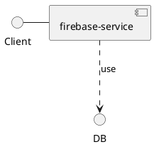

# firebase-service

Here is technical documentation of the `firebase-service` service.

## Functionalities

*Legend:* ✅ Fully supported ❌ Not supported 〰️ Partially supported

| Item | Supported | Standards/Links | Description |
|------|:---------:|:---------------:|-------------|
| **Add** | | | _N/A_ |
| Some | ✅ | _N/A_ | _N/A_ |
| **Functionalities** | | | _N/A_ |
| For | ✅ | _N/A_ | _N/A_ |
| **Your** | | | _N/A_ |
| Service | ✅ | _N/A_ | _N/A_ |
| **Along** | | | _N/A_ |
| With | ✅ | _N/A_ | _N/A_ |
| **Non-functional** | | | _N/A_ |
| Ones | ✅ | _N/A_ | _N/A_ |

## Architecture Diagram

Find below architecture diagram:

You can also use diagram from the link:

[Architecture Diagram](architecture.puml.md)
